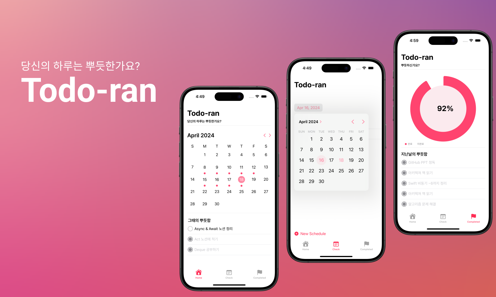

[![Swift Version][swift-image]][swift-url]
[![License][license-image]][license-url]

# Todo-ran
 

## Features

- [x] Create Schedule
- [x] Check Schedule
- [x] Update Schedule
- [x] Delete Schedule
- [x] Check Achievement

## Requirements

- iOS 17.0+
- Xcode 15.3

## Manual

[swift-image]:https://img.shields.io/badge/swift-5.1-orange.svg
[swift-url]: https://swift.org/
[license-image]: https://img.shields.io/badge/License-MIT-blue.svg
[license-url]: LICENSE
